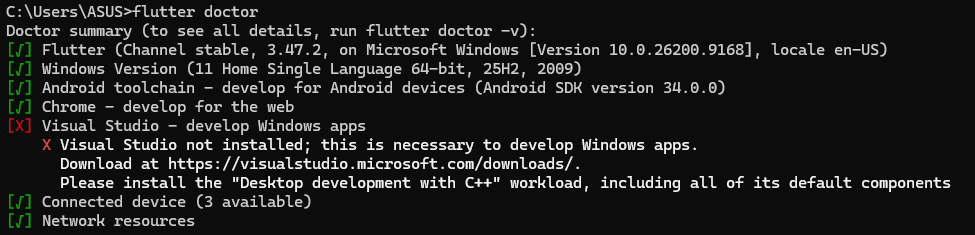
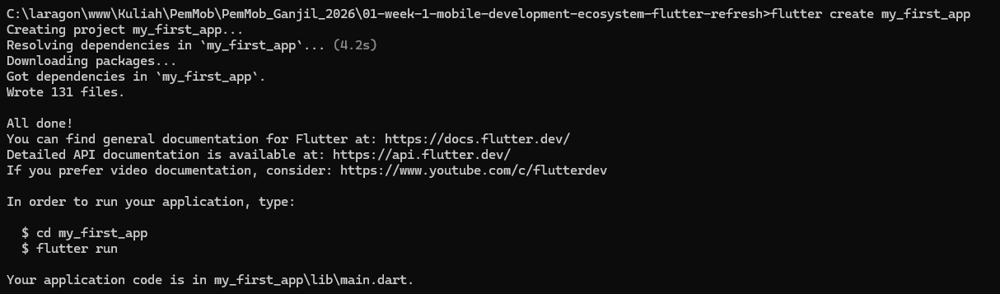
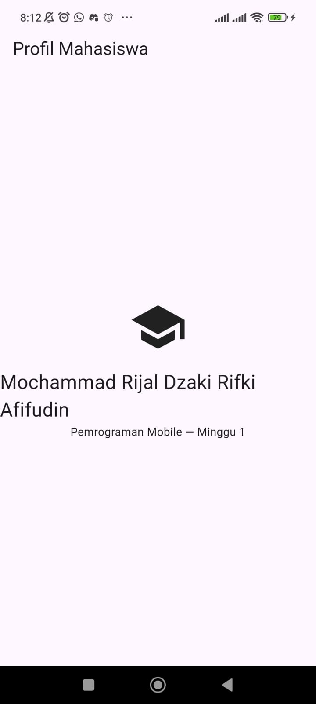
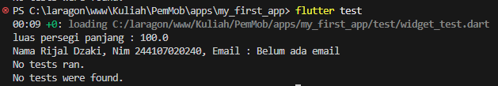
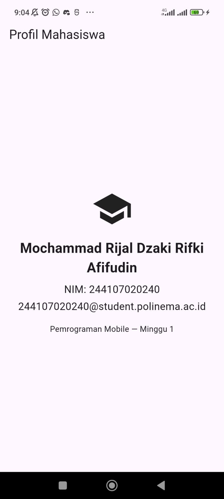

# Laporan Praktikum Minggu 1: Mobile Development Ecosystem & Flutter Refresh

**Nama:** Mochammad Rijal Dzaki Rifki Afifudin
**NIM:** 244107020240

Berikut adalah hasil pengerjaan praktikum minggu pertama untuk pengenalan dasar Flutter.

## 1. Bukti Instalasi dan Setup

Pada tahap awal, instalasi dan konfigurasi Flutter SDK beserta Android Studio telah dilakukan. Berikut adalah screenshot bukti bahwa environment sudah terpasang dan aplikasi dapat berjalan dengan baik:

**Pengecekan `flutter doctor`**  


**Pembuatan Project Baru (`flutter create`)**  


**Hasil Run Aplikasi**  


## 2. Kendala Saat Setup

Saat mengatur environment, kendala utama yang ditemui adalah lamanya proses unduhan komponen Android SDK dan setup virtual device (emulator) karena ukurannya yang cukup besar. Selain itu, terdapat sedikit kendala saat mendaftarkan path Flutter ke environment variables Windows, namun setelah penyesuaian dilakukan, perintah `flutter` dapat dikenali dengan baik di terminal.

## 3. Latihan Mandiri: Dart Refresh

Pada latihan ini, sebuah fungsi `hitungLuasPersegiPanjang` dan class `Profil` telah diimplementasikan di dalam file `test/widget_test.dart` untuk menguji pemahaman dasar sintaks Dart beserta penanganan nilai _null_ secara aman (_null-safety_). Berikut adalah dokumentasinya:

**Kode Implementasi:**

```dart
void main() {
  double luas = hitungLuasPersegiPanjang(10, 10);
  print('luas persegi panjang : $luas');

  Profil profil1 = Profil(nama: 'Rijal Dzaki', nim: '244107020240');
  String emailDitampilkan = profil1.email ?? 'Belum ada email';
  print('Nama ${profil1.nama}, Nim ${profil1.nim}, Email : $emailDitampilkan');
}

double hitungLuasPersegiPanjang(double panjang, double lebar) {
  return panjang * lebar;
}

class Profil {
  Profil({required this.nama, required this.nim, this.email});
  final String nama;
  final String nim;
  final String? email;
}
```

**Hasil Eksekusi (`dart run test/widget_test.dart`)**  


## 4. Hot Reload vs Hot Restart

Dari hasil percobaan mengubah kode UI di `main.dart`, berikut adalah perbedaan dari kedua fitur tersebut:

- **Hot Reload (`r`):** Prosesnya sangat cepat dan instan. Fitur ini memperbarui tampilan UI tanpa mereset data atau state yang sedang berjalan. Sangat efisien digunakan ketika sedang menyesuaikan desain atau layout aplikasi.
- **Hot Restart (`R`):** Memakan waktu sedikit lebih lama karena aplikasi dimatikan dan dinyalakan ulang dari awal. Semua data dan state akan ter-reset kembali ke titik awal. Fitur ini digunakan ketika terdapat perubahan pada logika program atau penambahan variabel baru yang membutuhkan inisialisasi ulang.

## 5. Mini Assignment

Pada tugas mini ini, informasi NIM dan juga kelas telah ditambahkan pada tampilan utama aplikasi Profil Mahasiswa. Berikut adalah potongan kode yang disematkan pada bagian `Column` di dalam file `main.dart`:

```dart
              Text(
                'Mochammad Rijal Dzaki Rifki Afifudin',
                textAlign: TextAlign.center,
                style: TextStyle(fontSize: 24, fontWeight: FontWeight.bold),
              ),
              SizedBox(height: 8),
              Text('NIM: 244107020240', style: TextStyle(fontSize: 18)),
              SizedBox(height: 4),
              Text(
                '244107020240@student.polinema.ac.id',
                style: TextStyle(fontSize: 18),
              ),
              SizedBox(height: 16),
              Text('Pemrograman Mobile — Minggu 1'),
```

**Hasil Run Aplikasi**  


## 6. Jawaban Tugas Refleksi

**a. Kapan native lebih tepat dipilih daripada cross-platform?**  
Pendekatan native lebih tepat dipilih ketika aplikasi membutuhkan performa maksimal (seperti game 3D) atau membutuhkan integrasi langsung ke hardware perangkat secara mendalam (misalnya sensor khusus atau bluetooth tingkat lanjut). Sedangkan cross-platform lebih cocok digunakan untuk menghemat biaya dan mempercepat waktu rilis karena satu basis kode bisa digunakan untuk Android dan iOS sekaligus.

**b. Bagaimana perubahan state berhubungan dengan widget tree dan UI deklaratif?**  
Di Flutter, UI bersifat deklaratif, yang berarti tampilan layar adalah cerminan langsung dari state (data) saat ini. Ketika state berubah, instruksi perubahan elemen UI tidak perlu ditulis secara manual. Flutter secara cerdas akan otomatis membangun ulang (_rebuild_) bagian widget tree yang terdampak oleh perubahan data tersebut.

**c. Mengapa commit kecil dengan pesan jelas bermanfaat bagi pekerjaan tim dan portfolio?**  
Dalam lingkup kerja tim, commit yang kecil dengan pesan yang jelas sangat membantu proses pelacakan ketika terjadi _bug_. Hal ini memudahkan pencarian bagian kode yang bermasalah dan lebih aman apabila harus dilakukan _revert_ (dikembalikan ke versi sebelumnya). Untuk keperluan portofolio, hal ini menunjukkan pola kerja yang terstruktur dan rapi, dibandingkan menumpuk banyak perubahan kode sekaligus yang sulit dibaca.
